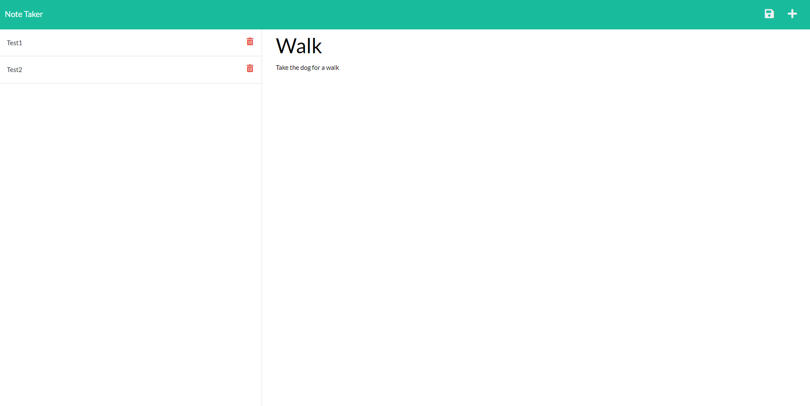

# Note Taker 

### By Mackenzie Gray

## Technologies Used 

- JavaScript
- Express.js
- Node.js
- HTML
- CSS 

## Description 

The motivation for this project was to create a note taker application to allow business owners to write and save notes in order to keep track of tasks that need to be completed. 

The applications front end connects to an Express.js back end which stores notes with unique IDs in a JSON file. The application is deployed to Heroku. 

## Outline of codebase writing

A codebase containing the HTML, CSS and index.js was provided in the public folder. In addition the following code was written. 

Node.js:
- Installation of express.js npm package
- Installation of uuid npm package

JavaScript:
- Writing of code to link and require Express.js, HTML routes and API routes.
- Establishing port connection to Heroku and local host. 
- Writing code for middleware.
- Writing and linking fsUtils.js page to allow for helper functions. 
- Writing of GET routes for notes.html and index.html files.
- Linking db.json file to API routes 
- Writing GET routes for receiving all notes as well as individual notes.
- Writing POST route for sending a new note to the back end and appending to the db.json file. 
- Writing DELETE route for deleting a note from the db.json file.

## Link to deployed Heroku application

[Click here to view the deployed application](https://calm-sea-51607.herokuapp.com/)

## Screenshots

